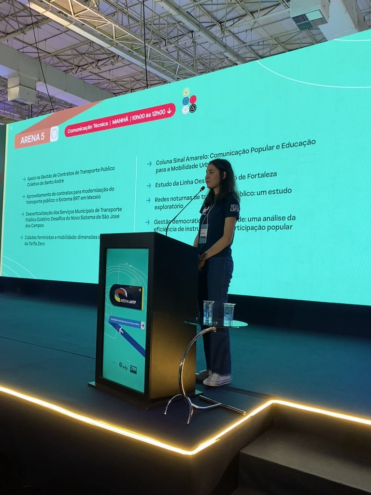

# Welcome!

Hi there! I'm Bia, and I am passionate about data, technology, mathematics and continuous learning. 
I am currently focused on data manipulation and data visualization for road safety researches at UFPR. 
I also participate in a lot of competitions in the statistics field, PET Estatística and research groups.
\
\
Here is a little more about me:
\
\
\

## Education

-   I'm currently working on my bachelor's degree in **Statistics and Data Science** at UFPR (Federal University of Paraná).
-   I have a degree in **Information Technology** at UEPG (State University of Ponta Grossa).
-   **Member of PET Estatística (UFPR)**: Engaged in academic and community-based projects related to statistics and data science.
-   I'm also a **Researcher in Statistics** at ONSV (National Road Safety Observatory)

## Programming Languages

-   **R**: Advanced. Focus on data visuzalization and Shiny dashboards.

-   **Python**: Intermediate. Focus on Mschine Learning Models.

-   **Email**: [beatrizda\@ufpr.br](mailto:beatrizda@ufpr.br){.email} / [absilvamarques\@gmail.com](mailto:absilvamarques@gmail.com){.email}
